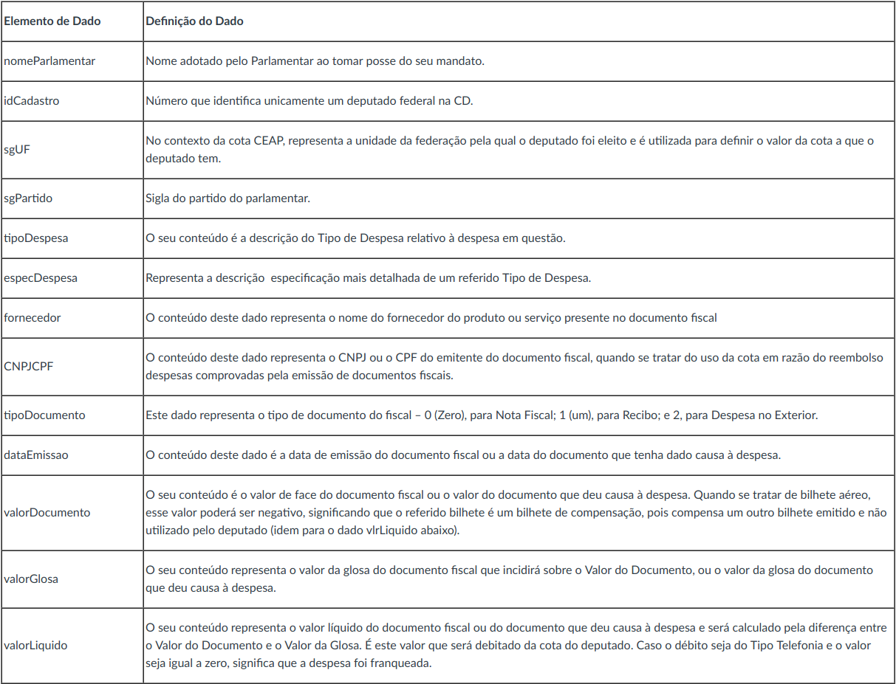

```{r, include=FALSE}
library('tidyverse')
library('gridExtra')
options(scipen = 999)
```
```{r, include=FALSE}
data <- read_csv('data/dadosCEAP.csv')
data <- data %>% filter(valorLíquido > 0)
```


```{r setup, include=FALSE}
knitr::opts_chunk$set(echo = TRUE)
```

## Descrição dos dados que serão utilizados nas análises


# Questão 1
### Dentre os 20 deputados que mais gastaram dinheiro da CEAP, quais foram os tipos de despesas mais utilizados? Compare com as despesas dos 20 que menos gastaram.
Como pode-se observar nos gráficos abaixo dos deputados que mais gastaram, as depesas mais utilizadas foram emissão de bilhetes aéreos, combustíveis e lubrificantes e telefonia. Já entre os deputados que menos gastaram as despesas mais utilizadas foram telefonia, serviços postais e combustíveis e lubrificantes. Analizando os dois gráfico é possível perceber que o gasto com emissão de bilhetes aéreo e telefonia tem um grande impácto nos gastos do dinheiro vindo do CEAP. Com base nessa análise é possivel questonar se realmente são necessários todos esses gastos com emissão de bilhetes aéreos e com telefonia.
```{r}
# Agrupando dadods pelo nome do parlamentar e o id do cadastro, caculando o valor total gasto pelo deputado e
# pegando os 20 deputados que mais gastaram
maisGastadores <- data %>% 
  group_by(nomeParlamentar, idCadastro) %>%
  summarise(custoTotal = sum(valorLíquido)) %>%
  arrange(-custoTotal) %>%
  ungroup() %>%
  slice(1:20)

# Agrupando dados pelo nome do parlamentar, id do cadatro e pelo tipo de despesa
# E calculando a quantidade de vezes que um determinado tipo de despesa ocorreu
despesasMaisUsadas <- data %>%
  group_by(nomeParlamentar, idCadastro, tipoDespesa) %>%
  summarise(quantidade = n())

# Filtando dados pelo nome dos parlamentares que mais gastaram dinheiro do CEAP
despesasMaisUsadasFiltradas <- despesasMaisUsadas %>% 
  filter(nomeParlamentar %in% maisGastadores$nomeParlamentar)

# Plotando gráfico com o ranking das despesas mais utilizadas do CEAP
despesasMaisUsadasFiltradas %>%
  group_by(tipoDespesa) %>%
  summarise(quantidade = sum(quantidade)) %>%
  arrange(-quantidade) %>%
  ggplot(aes(x=reorder(tipoDespesa, quantidade), y=quantidade, fill=tipoDespesa)) + 
  geom_col(width = 0.7, show.legend = FALSE) + 
  coord_flip() + labs(x = "Tipo de Despesa", y = "Quantidade")
```
```{r}
# Agrupando dadods pelo nome do parlamentar e o id do cadastro, caculando o valor total gasto pelo deputado e
# pegando os 20 deputados que menos gastaram
menosGastadores <- data %>% 
  group_by(nomeParlamentar, idCadastro) %>%
  summarise(custoTotal = sum(valorLíquido)) %>%
  arrange(custoTotal) %>%
  ungroup() %>%
  slice(1:20)

# Agrupando dados pelo nome do parlamentar, id do cadatro e pelo tipo de despesa
# E calculando a quantidade de vezes que um determinado tipo de despesa ocorreu
despesasMaisUsadas <- data %>%
  group_by(nomeParlamentar, idCadastro, tipoDespesa) %>%
  summarise(quantidade = n())

# Filtando dados pelo nome dos parlamentares que mais menos dinheiro do CEAP
despesasMaisUsadasFiltradas <- despesasMaisUsadas %>% 
  filter(nomeParlamentar %in% menosGastadores$nomeParlamentar)

# Plotando gráfico com o ranking das despesas mais utilizadas do CEAP
despesasMaisUsadasFiltradas %>%
  group_by(tipoDespesa) %>%
  summarise(quantidade = sum(quantidade)) %>%
  arrange(-quantidade) %>%
  ggplot(aes(x=reorder(tipoDespesa, quantidade), y=quantidade, fill=tipoDespesa)) + 
  geom_col(width = 0.7, show.legend = FALSE) + 
  coord_flip() + labs(x = "Tipo de Despesa", y = "Quantidade")
```

# Questão 2
### Quais os fornecedores que fornecem os serviços mais caros? E quais são que mais foram utilizados?
Nos gráficos abaixo podemos obsevar que os fornecedores de produtos mais caros de acordo com a mediana, não aparecem no ranking dos fornecedores mais usados no segundo gráfico, o que indica que os serviços prestados por eles não são tão utilizados, porém no segundo gráfico os fornecedores que aparecem no top do ranking são as companhias aéreas, mostrando que os deputados constumam viajar muito de avião, gerando muito gasto que pode não ser tão necessário assim. Olhando para o gráfico dos fornecedores mais caros pode-se observar que os preços dos serviços são muito altos variando entre 70 mil e 100 mil.
```{r}
# Agrupando fornecedores, calculando a mediana dos preços de seus serviços fornecidos
# e pegando os 10 fornecedores com maior mediana dos preços
# A mediana foi ecolhida por não ser afetada por valores extremos.
fornecedoresMaisCaros <- data %>% 
  group_by(fornecedor) %>%
  summarise(mediana = median(valorLíquido)) %>%
  arrange(-mediana) %>%
  slice(1:10)

# Plotando gráfico para mostrar os 10 fornecedores que oferecem os serviços mais caros
fornecedoresMaisCaros %>%
  ggplot(aes(x=reorder(fornecedor, mediana), y=mediana, fill=fornecedor)) + 
  geom_col(width = 0.7, show.legend = FALSE) + 
  coord_flip() + labs(x = "Fornecedor", y = "Mediana")
```

```{r}
# Agrupando fornecedores, contando quantas vezes seus seviços foram contratados
# e pegando os 10 fornecedores com maior quantidade de serviços contratados
fornecedoresMaisUsados <- data %>%
  group_by(fornecedor) %>%
  summarise(total = n()) %>%
  arrange(-total) %>%
  slice(1:10)

# Plotando gráfico dos 10 fornecedores mais usados
fornecedoresMaisUsados %>%
  ggplot(aes(x=reorder(fornecedor, total), y=total, fill=fornecedor)) + 
  geom_col(width = 0.7, show.legend = FALSE) + 
  coord_flip() + labs(x = "Fornecedor", y = "Quantidade")
```


